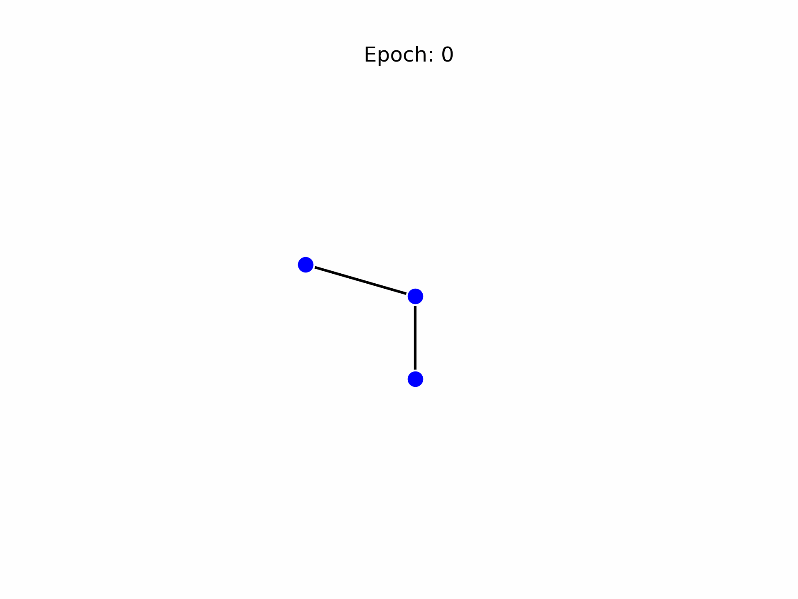
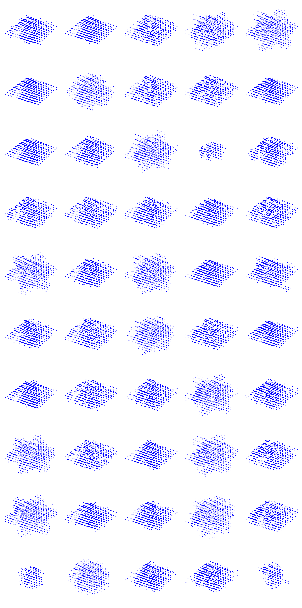

# Growing Graph Neural Cellular Automata
GNCAs for single-cell morphogenesis.

  

## Sample Pool

  

    
    
  

  
<em>50 random samples for 2D (M) and 3D (pyramid) targets. Left: epoch 1350; Right: epoch 19000.</em>

    
## Credits

- [m4mbo](https://github.com/m4mbo) - Code.
- [Mordvintsev et al.](https://distill.pub/2020/growing-ca/) - NCAs.
- [Gattarola et al.](https://proceedings.neurips.cc/paper/2021/hash/af87f7cdcda223c41c3f3ef05a3aaeea-Abstract.html) - GNCAs.

